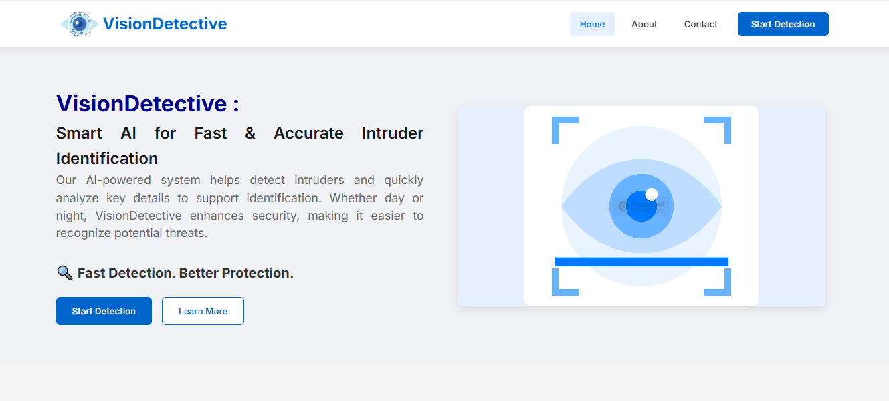
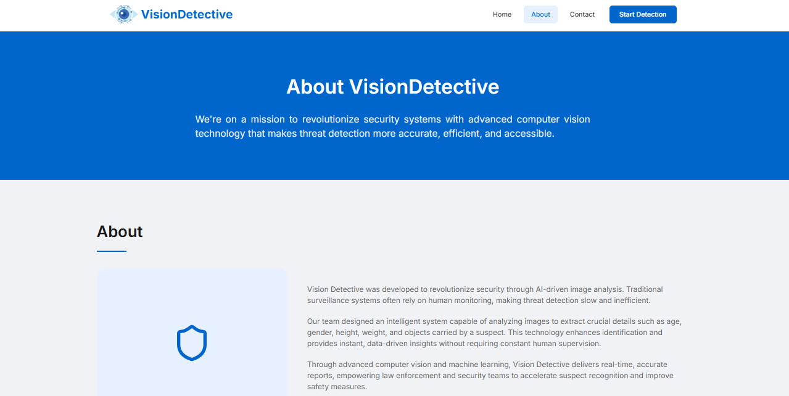
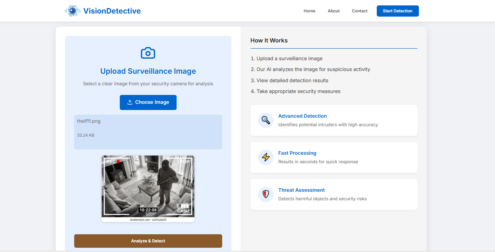
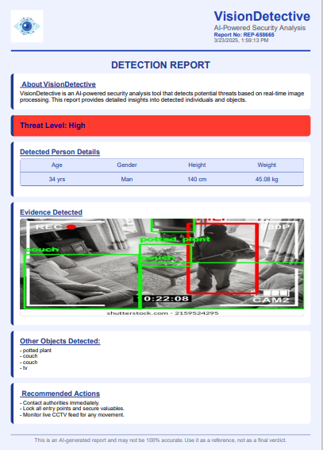

# 🔍 VisionDetective - AI-Powered Thief Detection  

  

---
## 🚀 Introduction  

VisionDetective is an **AI-powered thief detection system** that analyzes **surveillance images** to identify potential criminals. Using **YOLO (You Only Look Once)** and **Computer Vision**, the model detects thieves based on their **physical appearance** (gender, age, height, weight, and objects around them).  

The system assists **law enforcement officers** by providing **detailed reports and recommendations** to **track and arrest** suspects efficiently.  

---
## 🛑 Problem Statement  

With the increasing **crime rates**, identifying and capturing criminals in **low-light conditions** and from **surveillance images** remains a challenge. Traditional methods require **manual analysis**, which is slow and **prone to errors**.  

### ✅ VisionDetective Solves This By:  
✔️ **Detecting thieves** from images using deep learning models  
✔️ **Providing detailed information** (gender, age, height, weight, and objects)  
✔️ **Generating an automated report** for law enforcement  
✔️ **Assisting police officers** in quick suspect identification  

---

## 🎯 Why VisionDetective?  

🔹 **AI-Powered Analysis** – Uses **Computer Vision & YOLO** for **High accuracy**  
🔹 **Works in Low-Light** – Detects thieves even in **dim environments**  
🔹 **Detailed Reports** – Provides **structured data** for investigations  
🔹 **Fast & Efficient** – Automates **thief detection** in seconds  

---

## ⚙️ Technologies Used  

| Component   | Technology Used |
|------------|----------------|
| **Frontend**  | Vite + React.js + Tailwind CSS |
| **Backend**  | Python + YOLOv5 + OpenCV |
| **Deployment** | Render (Backend) + Vercel (Frontend) |

---

## 🖼️ Project Snapshots  

### 🏠 Home Page  
  

### ℹ️ About Page  
  

### 🔍 Detection Process  
  

### 📊 Detection Result  
  

### 📄 Generated Report  
  

  

---

## 🌐 Live Demo  

🔗 **Live Project:** [VisionDetective - Try Now](https://vision-detective-ai.vercel.app/)  

🔗 **Backend API:** [Python Server](https://github.com/VinayakR12/CV_Backend)  

---

## 📜 How It Works  

1️⃣ **Upload a surveillance image**  
2️⃣ **AI analyzes** the image and detects a potential thief  
3️⃣ **Model extracts** details: gender, age, height, weight, surroundings  
4️⃣ **System generates a report** for law enforcement  
5️⃣ **Authorities take action** based on insights  

---

## 🏆 Future Enhancements  

🔹 **Real-time video analysis** for live surveillance  
🔹 **Face recognition & criminal database matching**  
🔹 **Integration with law enforcement portals**  

---

## 🔥 Contact  
🔗 **GitHub:** [VisionDetective Repository](https://github.com/VinayakR12/VisionDetective_CV)  

---

